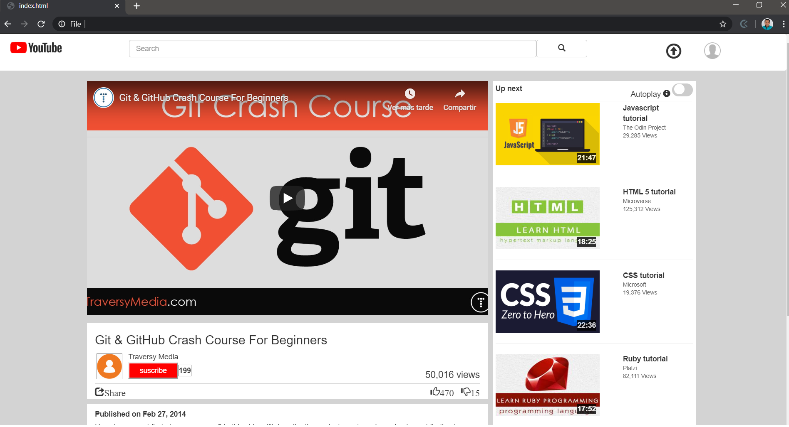

# First project - Youtube clone

> It is a small project about a Youtube clone using HTML and CSS.

## Built with

- Visual Studio Code

## Live Demo

[Live Demo Link](https://andresporres.000webhostapp.com/videoOscarSergio/index.html)

## Getting Started

**This is a basic HTML page, clone of Youtube, only with educational purposes.
**You can download this project and run using your browser. You do not need any library or additional framework.

## Authors

We are students at Microverse and it is our first project using HTML and CSS.

Oscar is a software developer from Colombia.

- Github: [@githubhandle](https://github.com/andresporras3423)

Sergio is a software developer from Peru.

- Github: [@githubhandle](https://github.com/sergiomauz)
